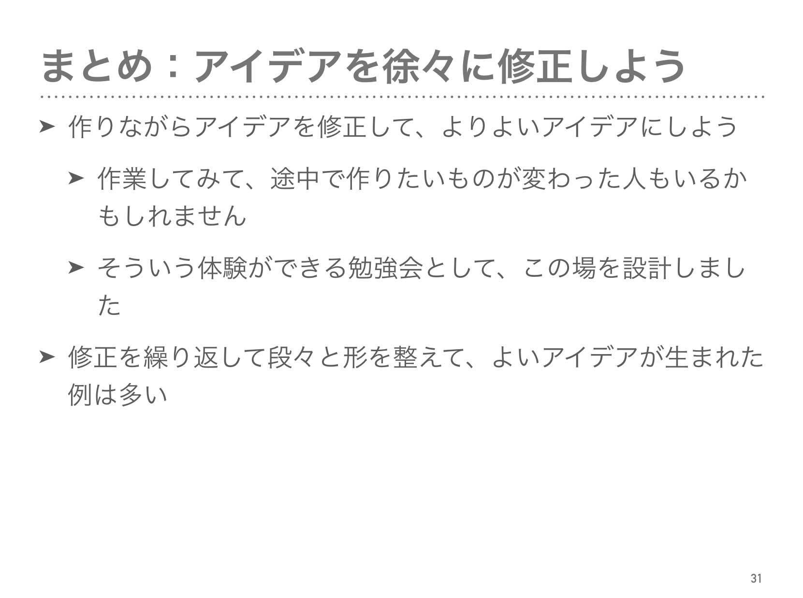
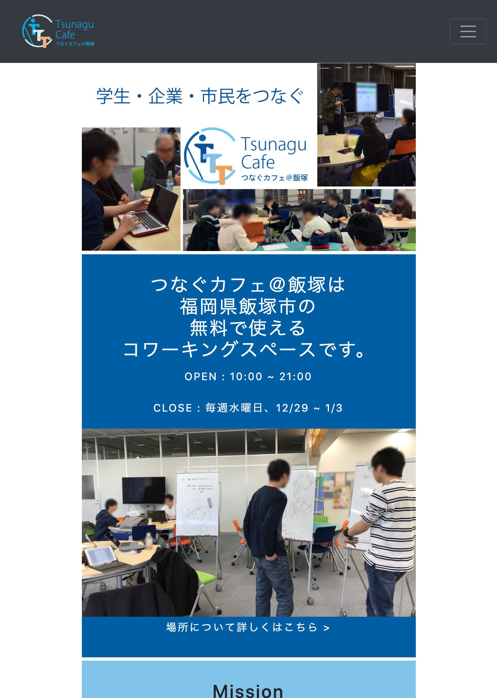
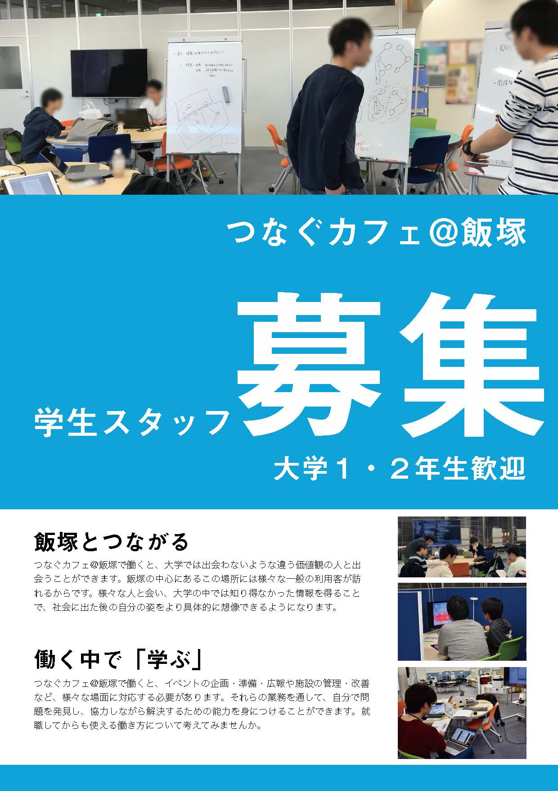

# 学び

### 人が新しいことを学び、変化することの支援

「自分が成長しているらしい」という感覚は楽しいので、積極的に新しいことに挑戦して、より良いと思われる方向へ変化して成長したいと考えています。また、できるならば周りの人も巻き込んで、巻き込んだ人からの良いフィードバックを得たいとも思っています。

もし人間が何か新しいことを学んだなら、何か不可逆な形で「変化」が起こるはずです。何かを学んだ後で、学ぶ前の状態に戻ることはできないと、素朴には思われます。

また、「学ぶ前の自分」から見ると、変化した後の「学んだ後の自分」がどうなっているのか想像することは難しいはずです。想像している自分そのものが大きく変化してしまうことを考えているので、自分がどう変化するのか、変化する前に見当をつけるのは、限りなく難しいはずです。

例えば、手を動かしてモノを作っている途中で、その作業を通して何かを学んだなら、作りたいものが途中で変わって完成形が最初の想像と全く異なるモノになることもありえると思います。作る前に作った後の自分がどう変化しているのかを想像できないという前提の上では、むしろ作りたいものが途中で変わる方が自然なのではないかとさえ思われます。

なので、途中で目標が変わったとしても、首尾一貫していないからと新しい目標を捨てたり、この新しいアイデアの方が間違っているんだと責めたりするのではなく、むしろ逆に、積極的に変化を受け入れて、新しいことに挑戦していきたいと考えています。

また、自分一人ではなく、複数人の相互作用の中で学ぶものも非常に多いので、周りの人を巻き込んで新しいことを行いたいとも考えています。

#### 実際に行ったこと

  

    
    
「レトロゲームを作ってみようの会」

    
学んでいる途中で「自分が変化する」ことを勘定に入れた方が、自分の成長につながるのではないかと伝えた勉強会です。

    <a href="/event/pyxel">詳しくはこちら ></a>
  

  

    
    
「競プロ勉強会」

    
自分でプログラミングの勉強をするときに役立つ知識や、もっと一般に、何かを学ぶときに役立つ知識を伝えるようにしました。

      <a href="/event/rantyao">詳しくはこちら ></a>
  

  

    
    
「プログラミング入門イベント」

    
参加者のみなさんが、能動的にプログラミングの勉強をしたくなるイベントを目指しました。

    <a href="/event/sinnyuusei">詳しくはこちら ></a>
  

### そもそも「学ぶ」とはどういうことか
上の議論は、もしかすると当たり前で、人間として自然なことかもしれないですが、こう感じている人は日本人全体に対して少ないのではないかと考えています。例えば、高校などでも、途中でやりたいことが変わるような、自信が自信を書き換えるプログラムのような学びよりも、むしろ、ブレない意志(?)を持って、最初から最後まで同じことをやり抜くように奨励しているように感じていました。

なので、このような学びに対する考え方の知見があるのは、初めは受け入れられなかった記憶があります。

ですが、知れば知るほど途中で変化するような学びの方が自然だと感じるようになってきました。

この考え方を広めて人からのフィードバックを得るのもいいのですが、そもそも本当に「学びに対するいい考え方」なのか検証するための道具として、学びに関する知見には非常に興味があります。

#### 実際に行ったこと

  

    
    
「春ゼミ『アイデアを思いつくには』」

    
U理論について取り扱ったゼミ。「変化が起こりやすい意識の状態にいたる道筋」について知った。

    <a href="/event/haruzemi2019">詳しくはこちら ></a>
  

  

    
    
「春ゼミ『アイデアを思いつくには』のリフレクション」

    
暗黙知について取り扱ったゼミ。暗黙知について深い理解はまだできていないが、「変化することでより良いものが作れる」という主張の根拠に使えると感じている。

      <a href="/event/haruzemi2019reflection">詳しくはこちら ></a>
  

# デザイン

### 「誰に」対して「何を」「なぜ」伝えるのか
バイト先でイベント告知のためのフライヤーやWebサイトを作っているうちに、人に何かを伝えるための情報の配置を考えるのが楽しくなってきました。

ここでいうデザインとは、『「誰に」対して「何を」「なぜ」伝えるのかをよく整理して作られたモノ』程度の意味です。このようなことについて考えていると、本質的な問題に取り組んでいる気分になることができて、非常に楽しいです。

また、伝えたい相手や目的がはっきりすればするほど、自ずからシンプルでかっこいいデザインのモノを作ることができると感じています。うまくいったときの感動はひとしおです。

「ノンデザイナーズ・デザインブック(第四版)」(Robin Williams (著), 小原 司 (監修, 翻訳), 米谷 テツヤ (監修, 翻訳), 吉川 典秀 (翻訳), マイナビ出版)は、いつも参考にしています。

#### 実際に制作したもの

  

    
    
伝えたい相手

    
「新しいことを学ぼう」という気が既にある人で、特にアルゴリズムに興味がある人。学ぶきっかけや、学びやすい環境を探している人。

    <a href="/flier/kyoupuroseptember">詳しくはこちら ></a>
  

  

    
    
伝えたい相手

    
飯塚の学生。特に、自分の活動を広めたい人、新しい技術で遊びたい人、活動や作業をしやすい場所を探している人。

    <a href="/website/tsunaguhugo">詳しくはこちら ></a>
  

  

    
    
伝えたい相手

    
「新しいことを学ぼう」という気が既にある人で、特にアルゴリズムに興味がある人。学ぶきっかけや、学びやすい環境を探している人。

    <a href="/flier/tsunagustaff">詳しくはこちら ></a>
  

### 「学び」に関する知見が役立っている

新しいデザインを考えるとき、自分が持っている「学び」に関する知見は非常に役立っていると感じています。

ここで、自分の普段のデザインのプロセスを考えてみます。例えば、「フライヤーのレイアウトのためのアイデア出し」は、誰に何を伝えたいのかを整理しつつ、人が作ったフライヤーの画像を見つつ、色々手を動かしてプロトタイプを作っていると、ふとかっこいいものが浮かんだりします。そのアイデアを人に見せつつさらに修正を繰り返します。最初は手段ばかりに注目(具体的な配置や色使い)してしまうのですが、考えているうちに整理が進み、解決すべき課題が見え、それを解決し、最後に解決方法が正しいのかの検証をしているのだと思います。

これはおそらく、新しいことを学ぶプロセスに似ています。

画像を見たり手を動かしたりして情報を集め、ふと得た情報の抽象化が起こり、その抽象化が正しいか検証するというのは、「観察　→　仮説　→　実験　→　仮説 ...」といった昔ながらの科学の手法に似ています。この手法は西洋で科学が進展する途中で「人間が新しい知識を得るための手法」を抽象化したもので、学びの方法の一種です。

吉田は「U理論」に興味があるのですが、U理論もこの手法と似たところがあります。

「観察　→　仮説　→　実験　→　仮説 ...」のサイクルがうまく回っているかどうかを測る指針の一つとして、ポランニーの「暗黙知」があります。まだ暗黙知について深い理解はないのですが、これが指針になっていそうだと、それこそ「暗黙知」的に感じています。

  

    
    
「春ゼミ『アイデアを思いつくには』」

    
U理論について取り扱ったゼミ。「変化が起こりやすい意識の状態にいたる道筋」について知った。

    <a href="/event/haruzemi2019">詳しくはこちら ></a>
  

  

    
    
「春ゼミ『アイデアを思いつくには』のリフレクション」

    
暗黙知について取り扱ったゼミ。暗黙知について深い理解はまだできていないが、「変化することでより良いものが作れる」という主張の根拠に使えると感じている。

      <a href="/event/haruzemi2019reflection">詳しくはこちら ></a>
  

